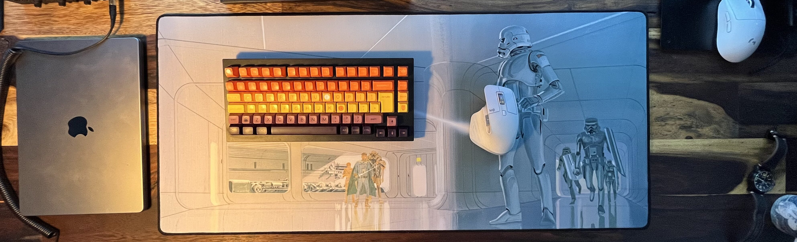

# Santtu Niskanen

Hello there! I'm a 21-year-old student based in Finland, currently studying Information Technology at Oulu University of Applied Sciences.
Besides working on software applications, I like Star Wars, mechanical keyboards, music and the nature.

---

    

---

 
My interests reside in the world of DevOps and Backend Development. I like to live in the terminal, using tools like Zellij (tmux), Neovim with countless plugins, and many other UNIX tools.
  
If you happen to be a recruiter looking for new hires, feel free to message me on LinkedIn.

---

