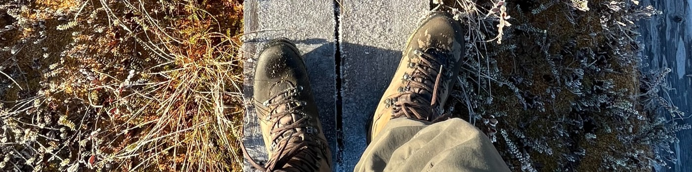

# Santtu Niskanen

Hello there! I'm a 21-year-old student based in Finland, currently studying Information Technology at Oulu University of Applied Sciences.
Besides working on software applications, I like Star Wars, mechanical keyboards, music and the nature.

---

    

---

 
My interests reside in the world of DevOps and Backend Development. I like <strong>Linux</strong> and I like to live in the terminal.
I'm currently working on Backend focused Full Stack development and I'm spending extra time learning <strong>Jenkins</strong> and <strong>Kubernetes</strong>.

---
